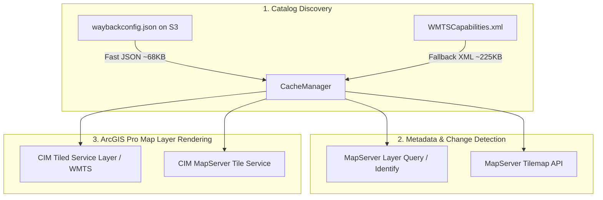

# Analysis & Diagnostics

### Root Cause Analysis: Why Metadata Querying Returned No Information

Investigation into the codebase, Esri's remote endpoints, and network responses identified three key issues:

1. **Metadata Service URL Formatting Bug (Zero-Padding Truncation)**:
   - In `wayback_addin/models.py`, the `metadata_service_url` property constructed service URLs by stripping leading zeros:
     ```python
     # Current buggy implementation in models.py:
     seq = match.group(2).lstrip("0") or "0"  # WB_2026_R07 -> r7
     return METADATA_SERVICE_BASE_URL.format(year=year, seq=seq)
     ```
   - This produced URLs like `World_Imagery_Metadata_2026_r7/MapServer`.
   - On Esri's servers, `World_Imagery_Metadata_2026_r7` is an empty dummy service containing **0 layers**.
   - The real, active Esri metadata MapServer services use two-digit zero-padded release numbers: `World_Imagery_Metadata_2026_r07` (which contains all **14 resolution sublayers**).
   - Because the service URL returned 0 layers, identify and query requests failed or returned empty results.

2. **WMTS Default Capabilities URL 404**:
   - `DEFAULT_WMTS_URL` in `wayback_addin/wmts_parser.py` was set to `https://wayback.maptiles.arcgis.com/arcgis/rest/services/World_Imagery/MapServer/WMTS/` (without `1.0.0/WMTSCapabilities.xml`), which returns an HTTP 404 error when fetched directly without cache.

3. **Sublayer Resolution Mapping vs. Generic Querying**:
   - The Esri Wayback metadata services host 14 distinct sublayers (Layer 0 to Layer 13), each corresponding to a specific ground resolution and scale range (from 1.9 cm resolution at Layer 0 / Zoom 23 down to 150 m resolution at Layer 13 / Zoom 10).
   - In Esri's JavaScript `wayback-core` repository, the exact sublayer is computed directly from the map zoom level:
     $$\text{layerId} = \max(0, \min(13, 23 - \text{zoom}))$$
   - Querying `/World_Imagery_Metadata_YYYY_rNN/MapServer/{layerId}/query` with `geometry={lon},{lat}` and `spatialRel=esriSpatialRelIntersects` returns the exact ground capture date (`SRC_DATE`/`SRC_DATE2`), vendor/provider (`NICE_DESC`/`NICE_NAME`), resolution (`SRC_RES`), and accuracy (`SRC_ACC`) for that specific tile location and zoom level.

4. **Authoritative Release Catalog via `waybackconfig.json`**:
   - Esri publishes `https://s3-us-west-2.amazonaws.com/config.maptiles.arcgis.com/waybackconfig.json` containing the authoritative catalog of all releases.
   - Each entry includes:
     - `itemID`: ArcGIS Online Item ID (e.g., `85050f00f4f849f8bb352eb91b5e3db7`)
     - `itemTitle`: Human-readable title (e.g., `World Imagery (Wayback 2026-08-05)`)
     - `itemURL`: ArcGIS Online Item URL
     - `metadataLayerUrl`: The exact MapServer URL for metadata queries (e.g., `https://metadata.maptiles.arcgis.com/arcgis/rest/services/World_Imagery_Metadata_2026_r07/MapServer`)
     - `metadataLayerItemID`: ArcGIS Online Item ID of the metadata service
     - `layerIdentifier`: Canonical release identifier (e.g., `WB_2026_R07`)
     - Key in JSON dictionary: Canonical release number (e.g., `26334`), which directly matches the tilemap URL `/tilemap/{release_number}/{zoom}/{row}/{col}`.

# Architecture & Recommendation

### WMTS vs. ArcGIS MapServer Endpoints: Comparative Analysis

The user asked whether this implementation should continue to use WMTS or switch to ArcGIS MapServer endpoints using resources from `waybackconfig.json`.



#### Detailed Comparison

| Dimension | OGC WMTS Protocol | ArcGIS MapServer / REST Endpoints |
|---|---|---|
| **Catalog Metadata** | `WMTSCapabilities.xml` (~225 KB XML). Requires XML parsing; contains release titles, dates, and tile URL templates. Does not contain ArcGIS Online Item IDs or direct metadata service URLs. | `waybackconfig.json` (~68 KB JSON). Fast JSON parse; directly provides `release_number`, `itemID`, `itemURL`, `metadataLayerUrl`, and `layerIdentifier`. |
| **Metadata Queries** | Not supported by WMTS standard. WMTS `GetFeatureInfo` is not enabled for Wayback. | Fully supported via ArcGIS Server REST API (`/identify` and direct layer query `/MapServer/{layerId}/query`). Returns `SRC_DATE`, `NICE_NAME`, `NICE_DESC`, `SRC_RES`, `SRC_ACC`. |
| **Change Detection (Tilemap)** | Not available in standard WMTS. | Provided via REST endpoint: `/MapServer/tilemap/{release_number}/{z}/{y}/{x}`. Fast binary mask query. |
| **ArcGIS Pro In-Place Layer Updating** | Highly efficient. The add-in manipulates the layer's CIM definition (`wmtsLayerName = "WB_2026_R07"` and `template = "..."`) in-place without rebuilding or reconnecting layer objects. | ArcGIS Pro supports MapServer tile layers via `CIMInternetServerConnection`. However, in-place switching of sublayers across standalone MapServer services can trigger full layer reconnection. |
| **Authentication & Public Access** | 100% public, no Esri authentication token required. | 100% public on `wayback.maptiles.arcgis.com` and `metadata.maptiles.arcgis.com`. |

#### Recommendation: Unified Hybrid Architecture

1. **Use `waybackconfig.json` as Primary Catalog Discovery Source**:
   - Fetch and cache `waybackconfig.json` (with automatic fallback to `WMTSCapabilities.xml` if offline or unreachable).
   - This eliminates all guessing of `release_number` and `metadata_service_url`, provides item IDs, and speeds up parsing.

2. **Use ArcGIS MapServer REST API for Metadata and Tilemap**:
   - Query `/World_Imagery_Metadata_YYYY_rNN/MapServer/{layerId}/query` with `layerId = 23 - zoom` for high-precision metadata resolution.
   - Use `/MapServer/tilemap/{release_number}/...` for local change detection.

3. **Retain WMTS / Tiled Raster for In-Place Map Layer Rendering**:
   - Retain the current CIM WMTS connection layer for the active map display, as it enables instant, sub-millisecond timeline slider and stepper scrubbing without layer recreation.
   - Expose the ArcGIS Online `itemURL` and `itemID` in layer descriptions and tool outputs so users can also open the release in ArcGIS Online / Portal.

# Requirements

### Overview & Goals
Ensure accurate historical imagery metadata retrieval across all Wayback releases and map scales, introduce persistent file-based logging using the full project directory path, and integrate `waybackconfig.json` into the add-in's caching and query engine.

### Scope
- **In Scope**:
  - Implement a centralized file logger writing to `wayback_addin.log` in the project root directory.
  - Fix metadata service URL generation in `models.py` (ensure two-digit zero-padded `r01`..`r07`).
  - Create a `waybackconfig.json` loader module with multi-tier caching (memory + local JSON file cache + offline snapshot fallback).
  - Implement zoom-to-sublayer direct query (`/MapServer/{layerId}/query`) with fallback to `/identify`.
  - Fix `DEFAULT_WMTS_URL` in `wmts_parser.py`.
  - Update `IdentifyMetadataTool` and `WaybackCaptureDateTool` to leverage the enhanced query engine.
  - Update unit tests, documentation (`user_guide.md`, `developer_guide.md`), and `FEATURES.md`.
- **Out of Scope**:
  - Replacing the core CIM layer manipulation engine (WMTS in-place switching remains optimal for slider performance).
  - Modifying third-party ArcGIS Pro installation binaries.

### Functional Requirements
- **FR-1: Persistent File Logging**:
  - The add-in must initialize a `logging.FileHandler` or `RotatingFileHandler` writing to a log file located at the project root directory (resolved via `os.path.abspath(__file__)`).
  - All add-in modules (`cache`, `change_detector`, `map_manager`, `wmts_parser`, `config_loader`, and `.pyt` tools) must output structured logs to this file with timestamp, level, module name, and message.
- **FR-2: Authoritative Catalog Integration**:
  - The add-in must fetch and parse `waybackconfig.json` from `https://s3-us-west-2.amazonaws.com/config.maptiles.arcgis.com/waybackconfig.json`.
  - Parsed releases must contain `release_number`, `itemID`, `itemURL`, `metadata_service_url`, `title`, `release_date`, and `tile_url_template`.
  - If `waybackconfig.json` is unreachable, gracefully fall back to `WMTSCapabilities.xml` and disk cache.
- **FR-3: Accurate Metadata Resolution**:
  - `query_metadata` must derive the correct sublayer from map scale / zoom level (`layerId = max(0, min(13, 23 - zoom))`).
  - Query `/World_Imagery_Metadata_YYYY_rNN/MapServer/{layerId}/query` for point intersection and extract `SRC_DATE`, `SRC_DATE2`, `NICE_NAME`, `NICE_DESC`, `SRC_RES`, and `SRC_ACC`.
  - If direct sublayer query returns no records, fall back to MapServer `/identify` endpoint.
- **FR-4: Tool Integration & Feedback**:
  - `IdentifyMetadataTool` and `WaybackCaptureDateTool` must display accurate capture date, provider, resolution, and accuracy in geoprocessing messages and output parameters.

# Technical Design

### File Structure & Changes

```
TestEsriAddin/
├── wayback_addin/
│   ├── __init__.py           (export new modules and initialize logging)
│   ├── logger.py             (NEW: centralized file logging configuration)
│   ├── config_loader.py      (NEW: waybackconfig.json fetcher and parser)
│   ├── models.py             (fix metadata_service_url zero-padding)
│   ├── wmts_parser.py        (fix DEFAULT_WMTS_URL)
│   ├── cache.py              (integrate waybackconfig.json in CacheManager)
│   ├── map_manager.py        (implement layer query + identify fallback)
│   └── change_detector.py    (update scale-to-zoom and metadata resolution)
├── WaybackImagery.pyt        (wire updated logger and metadata queries)
├── wayback_addin.log         (runtime log output in project folder)
├── FEATURES.md               (record FT-017 and FT-018)
├── documentation/
│   ├── user_guide.md         (document metadata & logging updates)
│   └── developer_guide.md    (document waybackconfig.json & layer queries)
└── tests/
    ├── test_logger.py        (NEW: tests for file logger)
    ├── test_config_loader.py (NEW: tests for waybackconfig.json loader)
    ├── test_models.py        (update test for zero-padded URLs)
    ├── test_map_manager.py   (update tests for layer query)
    └── test_toolbox.py       (validate toolbox tools)
```

### Key Technical Decisions & Interfaces

#### 1. File Logger Configuration (`wayback_addin/logger.py`)
```python
import logging
from logging.handlers import RotatingFileHandler
import os

LOG_FILE_NAME = "wayback_addin.log"
PROJECT_ROOT = os.path.dirname(os.path.dirname(os.path.abspath(__file__)))
DEFAULT_LOG_PATH = os.path.join(PROJECT_ROOT, LOG_FILE_NAME)

def setup_file_logger(
    log_file_path: str = DEFAULT_LOG_PATH,
    level: int = logging.INFO,
    max_bytes: int = 5 * 1024 * 1024,
    backup_count: int = 3,
) -> logging.Logger:
    """Configures a RotatingFileHandler on the package logger."""
    ...
```

#### 2. Config Loader (`wayback_addin/config_loader.py`)
```python
WAYBACK_CONFIG_URL = "https://s3-us-west-2.amazonaws.com/config.maptiles.arcgis.com/waybackconfig.json"

def parse_wayback_config(config_dict: dict) -> List[WaybackRelease]:
    """Parses waybackconfig.json dictionary into sorted WaybackRelease instances."""
    ...
```

#### 3. Zoom-to-Sublayer Calculation & Direct Query
```python
def zoom_to_metadata_layer_id(zoom: int) -> int:
    """Maps Web Mercator zoom level (0-23) to metadata sublayer ID (0-13)."""
    return max(0, min(13, 23 - zoom))
```

# Testing

### Validation Approach
Verify all fixes and new features using pytest unit and integration tests with mocked HTTP network calls, local file system checks, and ArcGIS Pro mock environments.

### Key Scenarios
1. **Metadata Service URL Verification**:
   - Verify that `WB_2026_R07` maps to `World_Imagery_Metadata_2026_r07/MapServer` (not `r7`).
   - Verify that `WB_2014_R01` maps to `World_Imagery_Metadata_2014_r01/MapServer` (not `r1`).
   - Verify that all releases 01..09 maintain two-digit zero-padding.

2. **File Logger Verification**:
   - Verify log file creation at `C:\Users\nick.santos\OneDrive - California Department of Technology\Code\TestEsriAddin\wayback_addin.log`.
   - Verify log formatting, level filtering, and rotating handler rollover.

3. **`waybackconfig.json` Parser Verification**:
   - Verify parsing of mock and real `waybackconfig.json` payloads into `WaybackRelease` objects.
   - Verify extraction of `release_number`, `itemID`, `itemURL`, `metadata_service_url`, and `layerIdentifier`.

4. **Layer Query & Identify Fallback**:
   - Verify `zoom_to_metadata_layer_id` mapping for zoom levels 10 through 23.
   - Verify query parameter construction for `/MapServer/{layerId}/query`.
   - Verify parsing of `SRC_DATE`, `SRC_DATE2`, `NICE_NAME`, `NICE_DESC`, `SRC_RES`, and `SRC_ACC`.
   - Verify graceful fallback to `/identify` if `/query` encounters an error or empty result.

5. **Toolbox End-to-End Tests**:
   - Verify `IdentifyMetadataTool` and `WaybackCaptureDateTool` execution flows in `tests/test_toolbox.py`.

# Delivery Steps

### ✓ Step 1: Configure persistent file logger with full project path
Configure a centralized logging subsystem that attaches a file handler using the full path to a log file within this project directory.

- Create/update `wayback_addin/logger.py` with `setup_file_logger()` to establish a `RotatingFileHandler` writing to `wayback_addin.log` in the project root directory (`C:\Users\nick.santos\OneDrive - California Department of Technology\Code\TestEsriAddin\wayback_addin.log`).
- Hook file logging into `wayback_addin/__init__.py`, `cache.py`, `map_manager.py`, `change_detector.py`, and `WaybackImagery.pyt`.
- Ensure log formatting includes timestamp, level, logger name, and message, with error handling to gracefully degrade if the directory is read-only.
- Add unit tests verifying file handler initialization, full path resolution, and log message output.

### ✓ Step 2: Implement waybackconfig.json loader and fix metadata URL generation
Add support for loading and caching the official Esri Wayback configuration JSON (`https://s3-us-west-2.amazonaws.com/config.maptiles.arcgis.com/waybackconfig.json`) and fix release metadata URL generation.

- Create `wayback_addin/config_loader.py` to fetch, parse, and cache `waybackconfig.json` containing exact release numbers, ArcGIS Online item IDs, item URLs, and authoritative `metadataLayerUrl` endpoints.
- Update `WaybackRelease` in `wayback_addin/models.py` to maintain two-digit zero-padded release numbers in `metadata_service_url` (e.g., `r07` instead of `r7`) so URL derivation matches Esri's MapServer naming convention without stripping zeros.
- Update `CacheManager` in `wayback_addin/cache.py` to incorporate `waybackconfig.json` into the multi-tier cache (memory + local JSON file cache + offline snapshot fallback) alongside `WMTSCapabilities.xml`.
- Fix `DEFAULT_WMTS_URL` in `wayback_addin/wmts_parser.py` to point to the valid capabilities endpoint (`.../World_Imagery/MapServer/WMTS/1.0.0/WMTSCapabilities.xml`).
- Add comprehensive unit tests in `tests/test_config_loader.py` and update `tests/test_models.py` and `tests/test_cache.py`.

### ✓ Step 3: Upgrade metadata querying with zoom-to-sublayer mapping and fallback
Upgrade metadata resolution in `MapManager` and `change_detector` to support both zoom-level-to-sublayer direct query and MapServer identify endpoints.

- Implement zoom-to-sublayer mapping formula (`layer_id = max(0, min(13, 23 - zoom))`) based on Esri's `wayback-core` specification in `wayback_addin/map_manager.py` and `wayback_addin/change_detector.py`.
- Update `MapManager.query_metadata` to support querying the layer `/MapServer/{layerId}/query` directly as the primary approach, with fallback to `/MapServer/identify`.
- Ensure robust attribute parsing for `SRC_DATE`, `SRC_DATE2`, `NICE_NAME`, `NICE_DESC`, `SRC_RES`, and `SRC_ACC` across all resolution tiers.
- Add unit tests with mock HTTP responses for both direct sublayer queries and identify fallback responses.

### ✓ Step 4: Update toolbox tools, documentation, tests, and feature registry
Wire updated metadata and logging into ArcGIS Pro Python Toolbox tools, update documentation, and record features in registry.

- Update `IdentifyMetadataTool` and `WaybackCaptureDateTool` in `WaybackImagery.pyt` to utilize the upgraded metadata resolver and log tool activities to the file logger.
- Update `documentation/user_guide.md` and `documentation/developer_guide.md` with details on metadata service endpoints, layer query conventions, and file logging configuration.
- Update `FEATURES.md` with new feature entries (FT-017 for persistent file logging and FT-018 for `waybackconfig.json` integration & dual-mode metadata querying).
- Run full pytest test suite to confirm all unit and integration tests pass cleanly.