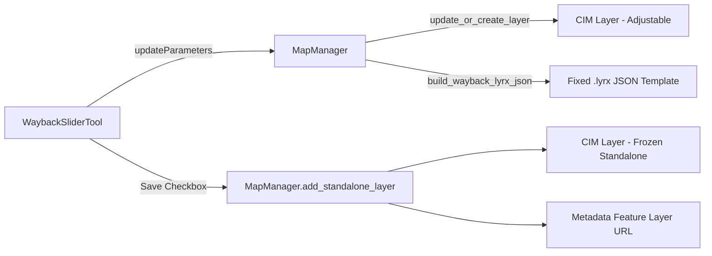

# Requirements

### Overview & Goals

Four changes to the Wayback Imagery add-in:
1. **Fix layer creation** — the `.lyrx` JSON template creates a layer with an invalid source
2. **Improve slider responsiveness** — layer should update more frequently without re-introducing validation loops
3. **"Save Layer" button** — add a checkbox to save the current Wayback layer as a standalone frozen layer while keeping the adjustable layer
4. **Click-to-identify metadata** — ensure layers show imagery metadata (acquisition date, provider, resolution, accuracy) when a user clicks a tile location

### Scope

#### In Scope
- Fix `build_wayback_lyrx_json()` in `map_manager.py` so new layer creation produces a valid ArcGIS Pro CIM source
- Adjust slider `updateParameters` to improve update frequency while still guarding against re-validation infinite loops
- Add a "Save Current Layer" checkbox parameter to `WaybackSliderTool` that duplicates the current imagery release as a frozen standalone layer
- Add a new `add_standalone_layer()` method to `MapManager` that creates a named, independent copy
- Investigate and implement metadata identification via Esri's Wayback metadata feature service REST endpoints or WMTS GetFeatureInfo as appropriate
- Update all existing tests and add new tests for all new functionality
- Update FEATURES.md, documentation, and summary report

#### Out of Scope
- Custom GUI frameworks (must use only Esri Python Toolbox parameter APIs)
- Installing new Python packages
- Changes to the WMTS parser or caching strategy

# Technical Design

### Current Implementation

**Layer Creation (Issue 1)**

The `build_wayback_lyrx_json()` function in `wayback_addin/map_manager.py` (L38–L94) generates a `.lyrx` JSON document that ArcGIS Pro loads via `arcpy.mp.LayerFile()`. There are two likely causes for the "invalid source" error:

1. **Wrong `type` for `serverConnection`**: The JSON uses `"type": "CIMInternetServerConnectionBase"` (L88), but this is an abstract base class in the CIM specification. ArcGIS Pro requires the concrete type `"CIMInternetServerConnection"` to be instantiated.

2. **Capabilities URL used as server connection URL**: The `serverConnection.url` (L89) is set to the full `WMTSCapabilities.xml` URL (e.g. `https://wayback.maptiles.arcgis.com/.../WMTSCapabilities.xml`). ArcGIS Pro WMTS connections typically expect the base service endpoint URL *without* the capabilities XML filename — i.e. `https://wayback.maptiles.arcgis.com/arcgis/rest/services/World_Imagery/MapServer/WMTS`.

3. **Missing `version` property**: The `CIMWMTSServiceConnection` has a `version` property that should be set to `"1.0.0"` for standards compliance.

**Slider Responsiveness (Issue 2)**

The current `WaybackSliderTool.updateParameters()` (L340–L412) relies on `hasBeenValidated` to prevent re-validation loops. When `hasBeenValidated=True`, updates are completely skipped. ArcGIS Pro sets `hasBeenValidated=True` between the user-action and when the user "releases" the slider or clicks elsewhere. This means updates only apply when the user stops interacting.

To improve responsiveness, we can use a more nuanced approach: instead of returning immediately when `hasBeenValidated=True`, we can additionally track the `altered` property — the `altered` flag stays `True` as long as the user has changed the parameter from its initial value. We should also check if the *current slider value* resolves to a *different release* than `_last_processed_release_id`, allowing re-validation cycles that carry genuinely new slider positions to proceed.

**Save Layer Feature (Issue 3)**

This requires:
- A new checkbox parameter in `WaybackSliderTool.getParameterInfo()` (parameter index 4)
- Logic in `updateParameters` to detect when the checkbox is checked, create a standalone layer, then uncheck the checkbox
- A new `MapManager.add_standalone_layer()` method that creates an independent named layer separate from the managed adjustable layer

**Click-to-Identify Metadata (Issue 4)**

Esri's Wayback service doesn't support standard OGC GetFeatureInfo on the WMTS tiles. However, each Wayback release has an associated **metadata feature service** (MapServer/FeatureServer) published on ArcGIS Online, which supports Identify/Query operations to return acquisition date, provider, source, resolution, and accuracy for any point location.

The approach is to add popup information to the CIM layer definition using `CIMPopupInfo` or by adding a URL action/hyperlink in the layer definition that points users to the metadata. Since WMTS tile layers in ArcGIS Pro don't natively support click-to-identify for feature popups, the practical approach is to:
- Add an accompanying metadata feature layer via its REST endpoint (e.g. querying `https://metadata.maptiles.arcgis.com/arcgis/rest/services/World_Imagery_Metadata/<releaseNum>/MapServer/0/query`) when saving a standalone layer
- Document how users can use ArcGIS Pro's built-in Identify tool with the metadata layer
- Add popup/description metadata to the CIM layer definition to at least show which release the layer represents

### Key Decisions

1. **Fix `CIMInternetServerConnectionBase` → `CIMInternetServerConnection`**: Use the concrete CIM type in the generated `.lyrx` JSON.
2. **Normalize server connection URL**: Strip the capabilities filename, using only the WMTS service base URL.
3. **Slider update strategy**: Replace the simple `hasBeenValidated` early-return with a check that allows re-processing when the slider position has actually changed since the last update, regardless of `hasBeenValidated` status. Keep `_last_processed_release_id` as the deduplication guard.
4. **Save layer**: Use a GPBoolean checkbox that triggers layer duplication in `updateParameters` and auto-resets to unchecked.
5. **Metadata approach**: Since WMTS tile layers don't support native popup/identify in ArcGIS Pro, document the metadata service URL pattern in the layer description and optionally add a lightweight metadata feature layer when saving a standalone layer.

### Proposed Changes

#### `wayback_addin/map_manager.py`
- Fix `build_wayback_lyrx_json()`: Change `CIMInternetServerConnectionBase` → `CIMInternetServerConnection`, strip capabilities XML filename from URL, add `version: "1.0.0"` to service connection
- Also fix `apply_release_to_cim_layer()` L314 where `CreateCIMObjectFromClassName("CIMInternetServerConnectionBase", ...)` should use `"CIMInternetServerConnection"`
- Add `add_standalone_layer()` method that creates a frozen, independently named copy of a Wayback release layer
- Add `build_metadata_layer_url()` helper that constructs the metadata feature service URL pattern for a release
- Update layer descriptions to include metadata service URL information

#### `WaybackImagery.pyt`
- `WaybackSliderTool.getParameterInfo()`: Add parameter 4 — "Save Current Layer" checkbox (GPBoolean, default False)
- `WaybackSliderTool.updateParameters()`: Revise re-validation guard logic; add save-layer handling
- `WaybackSliderTool.execute()`: Handle save-layer flag on manual execution too

#### `wayback_addin/models.py`
- Add `metadata_url` optional property or method to `WaybackRelease` to store/derive the metadata feature service URL

### Architecture Diagram

### File Structure

| File | Action | Description |
|------|--------|-------------|
| `wayback_addin/map_manager.py` | Modify | Fix lyrx JSON template, add standalone layer method, metadata URL helpers |
| `wayback_addin/models.py` | Modify | Add metadata URL derivation support |
| `WaybackImagery.pyt` | Modify | Add Save Layer checkbox, revise slider update logic |
| `tests/test_map_manager.py` | Modify | Add tests for fixed lyrx, standalone layers, metadata URLs |
| `tests/test_toolbox.py` | Modify | Add tests for save-layer checkbox, revised slider logic |
| `FEATURES.md` | Modify | Add new feature entries |
| `documentation/user_guide.md` | Modify | Document save-layer feature, metadata identification |
| `documentation/developer_guide.md` | Modify | Document metadata service integration, API changes |
| `.junie/reports/` | Create | Summary report |

### Risks

1. **CIM version compatibility**: The lyrx JSON fix targets CIM v3 (ArcGIS Pro 3.x). If users run an older version, the `CIMInternetServerConnection` type name may differ.
2. **Slider re-validation loop risk**: Relaxing the `hasBeenValidated` guard requires careful testing to avoid reintroducing infinite validation loops. The `_last_processed_release_id` deduplication acts as the safety net.
3. **Metadata service availability**: The Wayback metadata feature service URLs follow a pattern based on release numbers from the waybackconfig.json, which we don't currently parse. We may need to derive or approximate these URLs. Since the user can't test click-identify until layer creation works, this feature should be implemented iteratively.

# Testing

### Validation Approach

All changes will be validated through unit tests using mock objects (no live ArcGIS Pro runtime required). Existing tests will be updated to reflect changes, and new tests will cover all new functionality.

### Key Scenarios

#### Layer Creation Fix
- `build_wayback_lyrx_json()` generates JSON with `CIMInternetServerConnection` (not `Base`)
- Server connection URL ends with `/WMTS` (no capabilities XML filename)
- Service connection includes `version: "1.0.0"`
- `.lyrx` JSON structure validates against expected CIM format

#### Slider Responsiveness
- User changes slider → update fires (even if `hasBeenValidated=True` but value has changed)
- Same value re-validation → still skipped (dedup guard)
- No infinite loops: mutating param_info should not recursively trigger updates
- ArcGIS Pro reset-slider-to-default during re-validation → correctly handled

#### Save Layer Checkbox
- Checking the checkbox triggers `add_standalone_layer()` call
- Checkbox auto-resets to `False` after action
- Standalone layer gets a distinct name that doesn't match the adjustable layer regex
- Multiple saves create multiple independent layers

#### Metadata
- Layer descriptions include metadata service URL information
- Metadata URL construction produces valid patterns

### Edge Cases
- Save checkbox checked when no releases are available → graceful handling
- Save checkbox checked when no active map → error message
- Slider at boundary values (1 and total_releases) with save
- Layer creation in empty map (no existing Wayback layer)

### Test Changes
- `tests/test_map_manager.py`: Add tests for fixed lyrx JSON, `add_standalone_layer()`, metadata URL helpers
- `tests/test_toolbox.py`: Add tests for save-layer parameter, revised slider update logic, re-validation behavior with relaxed guards

# Delivery Steps

### ✓ Step 1: Fix layer creation lyrx JSON template and CIM types
Layer creation produces a valid ArcGIS Pro CIM source when `build_wayback_lyrx_json()` is called and when `apply_release_to_cim_layer()` creates new CIM objects.

- In `wayback_addin/map_manager.py`, change `build_wayback_lyrx_json()` (L88): replace `"type": "CIMInternetServerConnectionBase"` with `"type": "CIMInternetServerConnection"`
- Strip the capabilities XML filename from the server connection URL, using `https://wayback.maptiles.arcgis.com/arcgis/rest/services/World_Imagery/MapServer/WMTS` instead of the full `WMTSCapabilities.xml` path
- Add `"version": "1.0.0"` to the `CIMWMTSServiceConnection` JSON object
- In `apply_release_to_cim_layer()` (L314), change `CreateCIMObjectFromClassName("CIMInternetServerConnectionBase", "V3")` to `CreateCIMObjectFromClassName("CIMInternetServerConnection", "V3")`
- Add a helper function/constant to derive the base WMTS service URL from the capabilities URL
- Update `tests/test_map_manager.py` with assertions verifying the corrected JSON types, URL format, and version property
- Run all tests to confirm fixes pass

### ✓ Step 2: Improve slider update responsiveness
The slider tool updates the map layer more frequently as the user drags, without causing infinite re-validation loops.

- In `WaybackSliderTool.updateParameters()` in `WaybackImagery.pyt`, revise the re-validation guard logic:
  - Remove the blanket `if slider_already_validated: return` early exit
  - Keep `_last_processed_release_id` as the primary deduplication guard: if the resolved release matches the last processed one, skip
  - This allows re-validation cycles that carry a genuinely new slider position to proceed, while still preventing loops caused by param_info mutation
- Ensure `param_info` writes do not trigger recursive processing by checking release ID before modifying any parameter values
- Update existing slider tests in `tests/test_toolbox.py` that rely on `hasBeenValidated` behavior
- Add new test cases verifying that slider position changes are processed even when `hasBeenValidated=True`
- Add test cases confirming no infinite loops when the same release ID is resolved repeatedly
- Run all tests

### ✓ Step 3: Add Save Current Layer checkbox and standalone layer creation
A checkbox in the slider tool allows users to save the current imagery release as an independent frozen layer.

- In `wayback_addin/map_manager.py`, add `add_standalone_layer()` method that:
  - Creates a new Wayback layer with a distinct name (e.g. "Wayback 2026-08-05 (Saved)")
  - Uses a name pattern that does NOT match `WAYBACK_LAYER_REGEX` so `find_wayback_layer()` won't treat it as the adjustable layer
  - Generates the lyrx JSON using the fixed `build_wayback_lyrx_json()` and inserts into the map
- In `WaybackImagery.pyt`, modify `WaybackSliderTool.getParameterInfo()`: add parameter 4 — "Save Current Layer" checkbox (GPBoolean, default False)
- In `WaybackSliderTool.updateParameters()`: detect when the checkbox is checked, call `add_standalone_layer()`, then reset checkbox to False
- In `WaybackSliderTool.execute()`: handle save flag on manual execution as well
- Add tests in `tests/test_map_manager.py` for `add_standalone_layer()` — verify distinct naming, layer creation
- Add tests in `tests/test_toolbox.py` for save-layer checkbox — parameter exists, triggers layer creation, auto-resets
- Run all tests

### ✓ Step 4: Add metadata identification support and layer descriptions
Layers include metadata information and the user can identify imagery details at click locations.

- Research and document the Wayback metadata feature service URL pattern (e.g. `https://metadata.maptiles.arcgis.com/arcgis/rest/services/World_Imagery_Metadata/<releaseNum>/MapServer`)
- Add a `get_metadata_service_url()` helper to `MapManager` or `WaybackRelease` that constructs the metadata service URL from the release's tile URL template (extracting the release number)
- Update `build_wayback_lyrx_json()` and `apply_release_to_cim_layer()` to include descriptive metadata in the layer's `description` field (release date, release ID, metadata service URL)
- When creating a standalone layer via `add_standalone_layer()`, optionally include popup/hyperlink information pointing to the metadata service
- Add tests for metadata URL construction and description content
- Update `FEATURES.md` with new feature entries (FT-009 Save Layer, FT-010 Metadata Identification)
- Update `documentation/user_guide.md` with instructions for the Save Layer feature and metadata identification
- Update `documentation/developer_guide.md` with API changes and metadata service integration details
- Create summary report in `.junie/reports/`
- Run all tests to confirm everything passes

### ✓ Step 5: Fix metadata query to use identify endpoint with scale-aware sublayers
The metadata query always returns "no metadata features" because it queries layer 0 (1.9cm resolution) which only has data at extreme zoom levels. The Wayback metadata service has 14 sublayers (0-13) at different resolution scales. Switch to using the MapServer `identify` endpoint which automatically handles scale-dependent visibility and returns richer metadata fields.

- In `wayback_addin/map_manager.py`, rewrite `query_metadata()` to use the `identify` REST endpoint instead of `query` on layer 0
  - The identify endpoint URL: `{metadata_url}/identify` with parameters for geometry, mapExtent, imageDisplay, tolerance, layers=all, returnGeometry=false
  - The identify endpoint returns results from the scale-appropriate sublayer automatically
  - Parse the richer response format: `results[].attributes` with fields including `SRC_DATE2` (human-readable date like "10/11/2022"), `NICE_DESC` (provider like "Maxar"), `NICE_NAME`, `SRC_DESC`, `SRC_RES`, `SRC_ACC`
- Fix `SRC_DATE` parsing: the field is an integer in `YYYYMMDD` format (e.g., `20220412`), NOT an epoch timestamp in milliseconds. Also use `SRC_DATE2` when available as the human-readable date
- Add `map_scale` optional parameter to `query_metadata()` so the map's current scale can be passed through for the `mapExtent`/`imageDisplay` calculation
- Update all existing tests for `query_metadata()` in `tests/test_map_manager.py` to match the new identify-based approach
- Add new tests for the identify endpoint response parsing and SRC_DATE format handling
- Run all tests

### ✓ Step 6: Add map name dropdown and imagery layer selection to IdentifyMetadataTool
Replace the free-text "Target Map" parameter with a dynamic dropdown of actual map names, and add a new parameter listing Wayback imagery layers within the selected map.

- In `WaybackImagery.pyt`, modify `IdentifyMetadataTool.getParameterInfo()`:
  - Parameter 0: "Target Map" — GPString dropdown populated with map names from `arcpy.mp.ArcGISProject("CURRENT").listMaps()`, defaulting to the active map
  - Parameter 1: "Imagery Layer" — GPString dropdown listing Wayback imagery layers in the selected map, defaulting to the managed adjustable layer
  - Parameter 2: Derived output (metadata results)
- In `IdentifyMetadataTool.updateParameters()`: when map selection changes, repopulate the layer dropdown with Wayback layers from the newly selected map
- In `IdentifyMetadataTool.execute()`: use the selected layer to determine the release, rather than always using `get_current_release()`
- Add a `list_wayback_layers()` method to `MapManager` that returns all layers matching Wayback patterns (both managed and standalone/saved) in a given map
- Add `get_map_scale()` method to `MapManager` to read the current map view scale for the identify query
- Update tests in `tests/test_toolbox.py` for the new parameter structure
- Add tests in `tests/test_map_manager.py` for `list_wayback_layers()` and `get_map_scale()`
- Run all tests

### ✓ Step 7: Update documentation, FEATURES.md, and create summary report
Document all changes and create a summary report for this session.

- Update `FEATURES.md` with entries for the fixed metadata query and map/layer dropdowns
- Update `documentation/user_guide.md` with instructions for the improved Identify Imagery Metadata tool
- Update `documentation/developer_guide.md` with API changes (identify endpoint, map listing, layer listing)
- Create summary report in `.junie/reports/`
- Run all tests to confirm everything passes