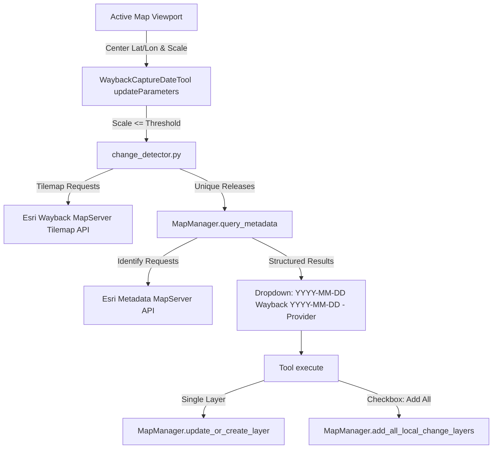

# Requirements

### Overview & Goals
Esri's World Imagery Wayback service contains hundreds of historical imagery basemap versions. Each basemap release represents a global composite published on a specific basemap release date, but the actual aerial and satellite imagery tiles within any given viewport were captured on distinct imagery acquisition dates (often differing significantly from the basemap release date). Furthermore, between consecutive Wayback basemap versions, many geographic areas experience no imagery updates.

This change introduces a new dedicated geoprocessing tool in the `WaybackImagery.pyt` toolbox that:
1. Detects which historical Wayback releases actually contain **local imagery changes** within the user's current map viewport.
2. Resolves and displays the **actual imagery capture date** (rather than only the basemap release date) alongside provider attribution and ground accuracy for each changed release.
3. Provides an interactive dropdown in the tool dialog formatted as `YYYY-MM-DD (Wayback YYYY-MM-DD - Provider)`.
4. Allows adding the selected release to the active map, or batch-adding all detected releases as separate standalone layers via a checkbox option.
5. Implements a user-configurable scale constraint (defaulting to 1:24,000) to ensure high-confidence local imagery capture dates.

---

### Scope

#### In Scope
- **Tilemap Change Detection Engine**: Implementation of the Esri Wayback tilemap query protocol (`/tilemap/{releaseNum}/{level}/{row}/{col}`) to identify historical releases with distinct tile imagery at the viewport location.
- **Capture Date & Metadata Resolution**: Automatic querying of each changed release's MapServer metadata identify endpoint to extract capture date (`SRC_DATE2` / `SRC_DATE`), provider (`NICE_DESC`), accuracy (`SRC_ACC`), and resolution (`SRC_RES`).
- **New Toolbox Tool (`WaybackCaptureDateTool`)**: Full ArcGIS Pro Python Toolbox tool registered in `WaybackImagery.pyt` with dynamic parameter validation (`updateParameters`) and execution logic.
- **Configurable Scale Guard**: Validates that map scale is at or closer than the configured scale threshold (default `1:24,000`), preventing misleading date aggregation at regional/global scales.
- **Batch Layer Addition**: Checkbox option to instantiate all detected local-change releases as individual named layers in the map.
- **Governance & Documentation**: Updates to `FEATURES.md`, `documentation/user_guide.md`, `documentation/developer_guide.md`, and `.junie/reports/`.

#### Out of Scope
- Modifying existing stepper (`WaybackStepperTool`) or slider (`WaybackSliderTool`) tools beyond shared utility imports.
- Pixel-level raster change detection algorithms (relies on Esri's official tilemap indexing and metadata services).
- Non-ArcGIS Pro platforms.

---

### User Stories
- **As a GIS Analyst**, I want to see only the historical Wayback releases that have actual imagery changes in my study area so that I don't waste time inspecting dozens of unchanged duplicate basemaps.
- **As a Cartographer or Researcher**, I want to see the exact acquisition date of the aerial photography (e.g., `2022-04-12`) rather than just the basemap publication date (e.g., `2022-05-18`) so that temporal analysis is accurate.
- **As a Remote Sensing Specialist**, I want to add all historical image releases for my area of interest as separate map layers in one click so that I can easily toggle visibility, perform swipe comparisons, or export temporal map series.

---

### Functional Requirements
1. **Viewport Analysis**:
   - Extract map center coordinates (WGS 84 longitude and latitude) and current map scale from the active or selected map view.
2. **Scale Validation**:
   - Provide a `Maximum Scale Threshold` parameter (GPLong, default `24000`).
   - If current map scale > threshold (e.g. 1:50,000 when threshold is 1:24,000), set a warning/error in `updateParameters` advising the user to zoom in.
3. **Local Change Detection**:
   - Convert geographic center coordinates to Web Mercator tile column, row, and zoom level.
   - Query Wayback MapServer tilemap endpoint recursively/iteratively from the latest release down through historical releases.
   - Deduplicate consecutive releases that share identical tile content / sizes.
4. **Capture Date & Metadata Query**:
   - Query the metadata feature service identify endpoint for each unique release with local changes.
   - Parse `SRC_DATE2` (string) or `SRC_DATE` (integer YYYYMMDD) into standard `YYYY-MM-DD` capture date format.
   - Extract imagery provider, ground accuracy, resolution, and source description.
5. **Dropdown Display**:
   - Populate dropdown with entries formatted as `YYYY-MM-DD (Wayback YYYY-MM-DD - Provider)` (e.g., `2022-04-12 (Wayback 2022-05-18 - Maxar)`).
   - Display full metadata summary (Capture Date, Wayback Release, Provider, Ground Accuracy, Resolution) in a descriptive text box.
6. **Execution Actions**:
   - When "Add All Listed Releases as Separate Layers" is unchecked: update/create the primary Wayback layer set to the selected capture date release.
   - When checked: add each listed release as a separate standalone layer named after its dropdown label.

---

### Non-Functional Requirements
- **Performance & Responsiveness**: Local change detection and metadata queries should be cached by spatial tile and scale to prevent redundant network calls during tool parameter revalidation.
- **Zero External Dependencies**: Pure Python standard library (`urllib.request`, `json`, `math`, `re`) and `arcpy` / `arcpy.cim`.
- **Fault Tolerance**: Gracefully handle network timeouts or releases without metadata by falling back to the basemap release date and noting metadata unavailability.

# Technical Design

### Current Implementation
The add-in currently contains:
- `WaybackStepperTool` & `WaybackSliderTool`: Single-layer time-stepping and timeline scrubbing based on global basemap release dates (`WaybackRelease.release_date`).
- `IdentifyMetadataTool`: Reads the center of the map view and queries the metadata `identify` endpoint for a single selected Wayback layer.
- `wayback_addin/models.py`: Data models `WaybackRelease` and `CapabilitiesMetadata`.
- `wayback_addin/map_manager.py`: CIM layer manipulation (`CIMTiledServiceLayer`, `CIMInternetServerConnection`), map layer discovery, and `query_metadata()` method for single releases.
- `wayback_addin/cache.py`: In-memory and disk caching for WMTS capabilities.

---

### Key Decisions
1. **Dynamic Dialog Discovery**:
   - *Decision*: Detect tile changes and query capture metadata automatically during tool parameter validation (`updateParameters`), while caching results by tile coordinate `(x, y, z)` in memory to maintain sub-second UI responsiveness.
   - *Rationale*: Provides immediate visibility into available capture dates as soon as the user opens the tool dialog or switches maps.
2. **User-Configurable Scale Threshold**:
   - *Decision*: Default to `1:24,000` scale limit while providing a tool parameter allowing users to adjust the maximum allowable scale.
   - *Rationale*: Balances USGS quadrangle standard local scale with flexibility for users working in broader rural or regional contexts.
3. **Dropdown and Layer Naming Convention**:
   - *Decision*: Format dropdown items and added layer names as `YYYY-MM-DD (Wayback YYYY-MM-DD - Provider)` (e.g. `2022-04-12 (Wayback 2022-05-18 - Maxar)`).
   - *Rationale*: Clearly distinguishes the ground capture date from the Wayback catalog release date and attributes the imagery vendor.

---

### Proposed Changes & Module Architecture

#### 1. Data Models (`wayback_addin/models.py`)
Add `LocalChangeImageryRelease` dataclass:
```python
@dataclass(frozen=True)
class LocalChangeImageryRelease:
    release: WaybackRelease
    capture_date: Optional[str]
    provider: Optional[str] = None
    accuracy: Optional[str] = None
    resolution: Optional[str] = None
    source: Optional[str] = None
    
    @property
    def formatted_display_name(self) -> str:
        cap_date = self.capture_date or "Unknown Date"
        rel_date = self.release.release_date or self.release.release_id
        prov = f" - {self.provider}" if self.provider else ""
        return f"{cap_date} (Wayback {rel_date}{prov})"
```

#### 2. Change Detection Engine (`wayback_addin/change_detector.py`)
New module providing:
- `lon_to_tile_x(lon: float, zoom: int) -> int`
- `lat_to_tile_y(lat: float, zoom: int) -> int`
- `scale_to_zoom_level(scale: float) -> int`
- `get_releases_with_local_changes(lon: float, lat: float, zoom: int, cache_manager: CacheManager) -> List[WaybackRelease]`
- `get_local_changes_with_metadata(lon: float, lat: float, scale: float, max_scale: float, cache_manager: CacheManager) -> List[LocalChangeImageryRelease]`

#### 3. Map Manager Enhancements (`wayback_addin/map_manager.py`)
- `get_map_view_center_and_scale(map_name: Optional[str] = None) -> Tuple[float, float, float]`
- `add_wayback_layer_as_separate(release: WaybackRelease, layer_name: str, map_name: Optional[str] = None) -> Any`
- `add_all_local_change_layers(releases: List[LocalChangeImageryRelease], map_name: Optional[str] = None) -> List[str]`

#### 4. Python Toolbox Tool (`WaybackImagery.pyt`)
Add `WaybackCaptureDateTool`:
- Parameters:
  - 0: `target_map` (GPString, ValueList, Required)
  - 1: `scale_threshold` (GPLong, Optional, default `24000`)
  - 2: `release_date` (GPString, ValueList, Required)
  - 3: `add_all_layers` (GPBoolean, Optional, default `False`)
  - 4: `imagery_details` (GPString, Derived, Output)
- `updateParameters()`: Checks scale threshold, triggers change detection & metadata query, populates `release_date.filter.list`, updates `imagery_details`.
- `execute()`: Adds selected or all layers to the map.

---

### Architecture Diagram



---

### File Structure
- `wayback_addin/models.py` (modified: add `LocalChangeImageryRelease`)
- `wayback_addin/change_detector.py` (new: tilemath, tilemap query, change detection pipeline)
- `wayback_addin/map_manager.py` (modified: viewport inspection, batch layer creation)
- `wayback_addin/cache.py` (modified: add tilemap query memory caching)
- `WaybackImagery.pyt` (modified: add `WaybackCaptureDateTool`, register in `Toolbox.tools`)
- `WaybackImagery.WaybackCaptureDateTool.pyt.xml` (new: tool documentation XML)
- `tests/test_change_detector.py` (new: tests for tilemath and tilemap detection)
- `tests/test_toolbox.py` (modified: test `WaybackCaptureDateTool` parameters and execution)
- `tests/test_map_manager.py` (modified: test standalone batch layer creation)
- `FEATURES.md` (modified: register FT-016)
- `documentation/user_guide.md` & `documentation/developer_guide.md` (modified: user and API documentation)

---

### Risks & Mitigations
- **Network Latency during Tool Validation**: Querying 10–20 metadata services sequentially could cause UI lag.
  - *Mitigation*: Cache results by rounded `(lon, lat, zoom)` key; query only unique changed releases; apply efficient timeout limits on HTTP requests.
- **Scale Inconsistency Across Viewport**: At regional zoom levels, one tile might have imagery from 2020 while another tile has imagery from 2024.
  - *Mitigation*: The scale threshold guard (default 1:24,000) prevents execution at regional scales where viewport tiles span multiple mosaic blocks.

# Testing

### Validation Approach
Verification will be performed through functional unit tests and mock integration tests covering tile math, HTTP request handling, metadata extraction, parameter validation, and layer management. All tests will run via `pytest` without requiring live ArcGIS Pro or external network connectivity.

---

### Key Scenarios
1. **Tile Coordinate and Scale Calculations**:
   - Validate conversion of WGS 84 geographic coordinates to Web Mercator tile coordinates across zoom levels 14 to 19.
   - Verify calculation of zoom level from map scale (e.g. 1:24,000 → Level 15, 1:10,000 → Level 16).
2. **Tilemap Local Change Detection**:
   - Mock Wayback MapServer tilemap responses with varying `data`, `select`, and `size` fields.
   - Test recursive backwards traversal and verification that duplicate releases (matching tile sizes) are filtered out.
3. **Capture Date & Metadata Resolution**:
   - Mock metadata identify endpoint responses returning `SRC_DATE2` (string) and `SRC_DATE` (integer YYYYMMDD).
   - Test formatting of `LocalChangeImageryRelease.formatted_display_name`.
4. **Tool Parameter Validation & Scale Guard**:
   - Test `updateParameters()` when map scale is 1:10,000 (valid) vs 1:50,000 (exceeds 1:24,000 threshold).
   - Confirm error/warning messages are set when scale threshold is exceeded.
5. **Execution Workflows**:
   - Test single layer update when `add_all_layers` is `False`.
   - Test batch layer creation when `add_all_layers` is `True`, verifying all layers are added to the map with their respective formatted names.

---

### Edge Cases
- **No Local Changes Found**: When tilemap indicates no changes, handle gracefully by returning the latest release with an explanatory message.
- **Metadata Endpoint Unavailable / Missing Attributes**: When a metadata query fails or returns empty attributes, fall back to the release date without failing.
- **Non-Standard Dates**: Handle both string dates (`"10/11/2022"`) and integer dates (`20221011`) correctly.
- **Invalid Scale or Polar Coordinates**: Ensure geographic bounds and scale values are clamped safely.

---

### Test Changes
- `tests/test_change_detector.py`: Add test suite for `change_detector.py` functions and tilemap parsing.
- `tests/test_models.py`: Add tests for `LocalChangeImageryRelease` initialization and formatting.
- `tests/test_map_manager.py`: Add tests for `add_wayback_layer_as_separate` and `add_all_local_change_layers`.
- `tests/test_toolbox.py`: Add tests for `WaybackCaptureDateTool` parameter initialization, validation, and execution.

# Delivery Steps

### ✓ Step 1: Implement Local Change Detection & Metadata Resolution Engine
Implement the core data models and tilemap change detection logic for identifying Wayback releases with local changes.

- Add `LocalChangeImageryRelease` dataclass to `wayback_addin/models.py` capturing `WaybackRelease`, `capture_date`, `provider`, `accuracy`, `source`, `resolution`, and formatted `display_label`.
- Create `wayback_addin/change_detector.py` containing:
  - Coordinate and tile math helpers: `lon_to_tile_x`, `lat_to_tile_y`, `scale_to_zoom_level`.
  - `get_releases_with_local_changes(lon, lat, zoom)` querying the Wayback MapServer tilemap REST API (`/tilemap/{releaseNum}/{level}/{row}/{col}`) backwards through history.
  - Tile size deduplication logic to eliminate redundant identical tiles across successive releases.
  - `get_local_changes_with_metadata(lon, lat, scale, max_scale)` coordinating tilemap scanning and concurrent metadata queries via `MapManager.query_metadata`.
- Add unit tests in `tests/test_change_detector.py` and `tests/test_models.py` with mock HTTP responses for tilemap endpoints.

### ✓ Step 2: Extend MapManager for Standalone Layer Creation & Viewport Inspection
Extend `MapManager` to support camera viewport analysis and multi-layer addition for local change releases.

- Add viewport extraction helpers to `wayback_addin/map_manager.py` to retrieve active/target map view center (WGS84 lon, lat) and current map scale.
- Implement `add_wayback_layer_as_separate(release, layer_name, map_name)` to create standalone, independently named Wayback CIM layers in the map.
- Implement `add_all_local_change_layers(releases_with_metadata, map_name)` to batch-add all detected releases as separate layers.
- Implement cache layer in `wayback_addin/cache.py` for tilemap change scan results keyed by rounded coordinates and zoom level.
- Add unit tests in `tests/test_map_manager.py` validating viewport inspection, standalone layer creation, and batch layer addition.

### ✓ Step 3: Implement WaybackCaptureDateTool in Python Toolbox
Implement the new `WaybackCaptureDateTool` class in `WaybackImagery.pyt` and register it in the toolbox.

- Define `WaybackCaptureDateTool` with parameters:
  - `target_map`: Dynamic dropdown of project maps.
  - `scale_threshold`: Maximum scale limit (default 1:24,000, user configurable).
  - `release_date`: Dropdown list of capture dates formatted as `YYYY-MM-DD (Wayback YYYY-MM-DD - Provider)`.
  - `add_all_layers`: Checkbox to add all listed releases as separate map layers.
  - `imagery_details`: Output text displaying provider, acquisition date, resolution, and accuracy.
- Implement `updateParameters()` with scale guard validation: checks if current map scale <= threshold; if valid, populates dropdown with local change capture dates; if out of scale, displays informative message.
- Implement `execute()` to apply the selected release to the active Wayback layer or batch-add all releases when the checkbox is checked.
- Register `WaybackCaptureDateTool` in `Toolbox.tools` and create the toolbox XML metadata file `WaybackImagery.WaybackCaptureDateTool.pyt.xml`.
- Add toolbox tests in `tests/test_toolbox.py`.

### ✓ Step 4: Documentation, Governance, and Verification
Update project feature registry, user and developer documentation, and execute all test suites.

- Update `FEATURES.md` with new feature ID `FT-016` (Wayback Local Changes & Capture Date Discovery Tool).
- Update `documentation/user_guide.md` with detailed instructions on using the Capture Date & Local Changes tool, scale constraints, and batch layer creation.
- Update `documentation/developer_guide.md` with architectural details of tilemap change detection and metadata query integration.
- Run complete test suite (`pytest`) to confirm all unit and mock integration tests pass.
- Generate execution summary report in `.junie/reports/summary_<date>_<time>.md`.