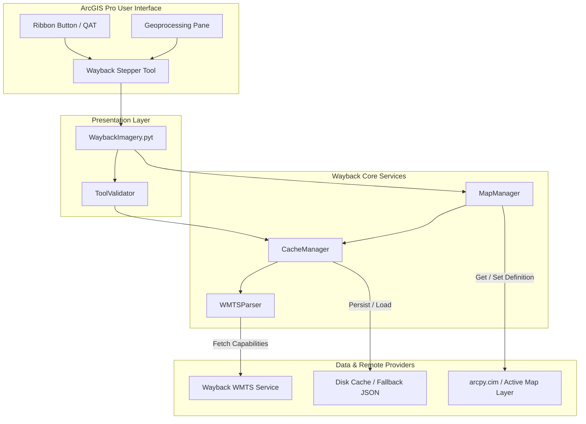

# Requirements

### Overview & Goals
The objective is to create a lightweight, responsive Python add-in / tool for ArcGIS Pro that provides interactive time-slider and stepwise navigation controls for historical imagery using Esri's Wayback World Imagery WMTS service (`https://wayback.maptiles.arcgis.com/arcgis/rest/services/World_Imagery/MapServer/WMTS/1.0.0/WMTSCapabilities.xml`).

The tool reads available historical release dates (190+ releases spanning from 2014 to present) directly from the WMTS capabilities, allows the user to step forward (newer) or backward (older) in time or jump to a specific release date, and updates a dedicated Wayback imagery base layer in the active ArcGIS Pro map in place without cluttering the map with duplicate layers.

### Scope
#### In Scope
- **WMTS Capabilities Discovery**: Automated parsing of Esri Wayback WMTS Capabilities XML to extract all release identifiers, release dates, titles, and tile URL templates.
- **Hybrid Metadata Caching**: Local file-based caching with TTL and in-memory runtime storage to ensure instantaneous parameter loading and ribbon button stepping without network lag.
- **Single-Layer Dynamic Map Management**: Intelligent detection and in-place updating of the active map's Wayback imagery layer using ArcGIS Pro Cartographic Information Model (`arcpy.cim`) and `arcpy.mp`.
- **ArcGIS Pro Python Toolbox (`.pyt`)**: A Python Toolbox exposing a unified time-stepper geoprocessing tool with dynamic parameter validation (`ToolValidator`) suitable for placement on the ArcGIS Pro Ribbon, Quick Access Toolbar, or Geoprocessing Pane.
- **Action Modes**: Stepping forward (newer date), stepping backward (older date), jumping to a specific date from a validated dropdown, jumping to the latest release, and jumping to the oldest release.
- **Comprehensive Testing & Documentation**: Standalone unit tests, mock integration tests, end-user ribbon customization guide, developer architecture documentation, and feature registry (`FEATURES.md`).

#### Out of Scope
- Direct modification of third-party Python packages or installation of external dependencies (uses purely the built-in Python standard library and `arcpy`).
- Legacy ArcMap 10.x Python Add-In format (`.esriaddin` / `pythonaddins`).
- Compiled C# / .NET ArcGIS Pro SDK add-in packages (`.esriAddinX`).

### User Stories
- **As a GIS Analyst**, I want to step chronologically through historical aerial imagery directly from ArcGIS Pro so that I can analyze land use, infrastructure, and environmental changes over time.
- **As an ArcGIS Pro User**, I want to click a ribbon button or run a simple tool to advance or rewind imagery by one release date so that I have a rapid, frictionless time-slider experience.
- **As a Cartographer**, I want the add-in to update the existing Wayback layer in my active map rather than generating new layers for every date switch so that my Contents table remains clean and organized.
- **As a Developer/Maintainer**, I want a modular codebase with unit tests and clear documentation so that future WMTS schema changes or ArcGIS Pro API updates can be integrated easily.

### Functional Requirements
- **FR-1: WMTS Metadata Retrieval**: The system must fetch and parse the WMTS Capabilities XML from the official endpoint, extracting all layer definitions, release identifiers (`WB_YYYY_RXX`), titles, and tile templates.
- **FR-2: Chronological Ordering**: Extracted releases must be parsed for valid ISO dates (`YYYY-MM-DD`) and sorted chronologically (newest to oldest or oldest to newest).
- **FR-3: Stepwise Navigation**: The tool must support:
  - `Step Forward (Newer)`: Shifts to the next newer release. If already on the newest, informs the user with an info message.
  - `Step Backward (Older)`: Shifts to the previous older release. If already on the oldest, informs the user with an info message.
  - `Jump to Specific Date`: Sets the layer to a selected date from the dynamically populated dropdown list.
  - `Jump to Latest Date`: Instantly switches to the most recent Wayback release.
  - `Jump to Oldest Date`: Instantly switches to the baseline Wayback release.
- **FR-4: In-Place Layer Updating**: The tool must inspect the active map in `arcpy.mp.ArcGISProject('CURRENT')`. If a Wayback imagery layer exists, it must update its CIM definition (`CIMTiledServiceLayer` / `CIMWMTSServiceConnection`) in place and refresh the layer title to reflect the active date. If no layer exists, it must construct and add the layer to the active map.
- **FR-5: Dynamic Parameter Validation**: In `WaybackImagery.pyt`, the `ToolValidator` must dynamically populate the release date parameter with cached dates and update parameter enable/disable states based on the chosen action mode.
- **FR-6: Caching & Offline Resilience**: WMTS metadata must be cached locally on disk with a configurable TTL (7 days default). If network requests fail, the tool must fall back to the local cache or bundled fallback metadata snapshot.

### Non-Functional Requirements
- **NFR-1: Zero External Dependencies**: Must run entirely on Python 3.11+ using only the Python standard library (`urllib`, `xml.etree.ElementTree`, `json`, `datetime`, `pathlib`, `re`) and native `arcpy` / `arcpy.cim`.
- **NFR-2: Sub-Second Interactive Stepping**: When using cached metadata, executing a step forward or step backward action must complete in sub-second time.
- **NFR-3: Clean Error Handling**: All network timeouts, missing maps, or missing layers must produce descriptive user-facing ArcGIS Pro messages (`arcpy.AddWarning` / `arcpy.AddError`) without crashing the application.
- **NFR-4: Traceability & Governance**: Maintain `FEATURES.md`, create markdown documentation in `documentation/`, and generate structured summary reports in `.junie/reports/`.

# Technical Design

### Current Implementation & Technical Context
- **Environment**: ArcGIS Pro 3.5.x with Python 3.11.11 x64 and native `arcpy` / `arcpy.cim`.
- **Capabilities Endpoint**: `https://wayback.maptiles.arcgis.com/arcgis/rest/services/World_Imagery/MapServer/WMTS/1.0.0/WMTSCapabilities.xml`.
- **Capabilities Structure**: Contains 196+ layers where each `<Layer>` element defines an `<ows:Identifier>` (e.g. `WB_2026_R07`), `<ows:Title>` (e.g. `World Imagery (Wayback 2026-08-05)`), and a `<ResourceURL template="...">` pointing to the tile server.
- **ArcGIS Pro CIM Integration**: ArcGIS Pro represents WMTS layers as `CIMTiledServiceLayer` with a `CIMWMTSServiceConnection` holding `layerName`, `templateUrl`, `tileMatrixSet` (`default028mm`), `imageFormat` (`image/jpeg`), and an inner `CIMInternetServerConnectionBase`.

### Key Decisions
- **Extension Model (Python Toolbox .pyt)**: Pure Python toolbox architecture allowing direct integration into the ArcGIS Pro ribbon, quick access toolbar, and geoprocessing workflows without requiring external compiled binaries.
- **Layered Modular Architecture**: Core logic is factored into pure Python modules (`models.py`, `wmts_parser.py`, `cache.py`, `map_manager.py`) so business logic can be tested in standard Python environments and imported by `WaybackImagery.pyt`.
- **Unified Stepper Tool Execution**: A single geoprocessing tool with an intuitive action mode parameter (`Step Forward`, `Step Backward`, `Jump to Date`, `Latest`, `Oldest`) allowing single-click execution from ribbon buttons or flexible date selection in the GP pane.
- **Hybrid Caching**: Two-tier caching combining an in-memory dictionary for active sessions and a local disk cache (`wayback_capabilities_cache.json`) with a 7-day TTL and offline snapshot fallback.
- **In-Place CIM Updating**: Uses `arcpy.cim` to modify the layer definition directly, preserving layer order, visibility, blend modes, and map layout references without deleting and re-adding layers.

### Architecture Diagram


### Data Models / Contracts
```python
@dataclass(frozen=True)
class WaybackRelease:
    """Represents a single historical imagery release."""
    release_id: str          # e.g., 'WB_2026_R07'
    title: str               # e.g., 'World Imagery (Wayback 2026-08-05)'
    release_date: str        # e.g., '2026-08-05' (ISO format YYYY-MM-DD)
    tile_url_template: str   # Tile URL template with parameters
    release_index: int       # Chronological index (0 = newest)
```

```python
class ICacheManager:
    def get_releases(self, force_refresh: bool = False) -> List[WaybackRelease]:
        """Returns sorted list of Wayback releases from memory, disk cache, or live WMTS."""
        ...
    def get_release_by_date(self, date_str: str) -> Optional[WaybackRelease]:
        ...
    def get_adjacent_release(self, current_release_id: str, direction: int) -> Optional[WaybackRelease]:
        """Returns the next (+1 = newer) or previous (-1 = older) release."""
        ...
```

```python
class IMapManager:
    def get_current_wayback_layer(self, map_name: Optional[str] = None) -> Optional[Tuple[arcpy.mp.Layer, WaybackRelease]]:
        """Finds the managed Wayback layer in the active map and detects its current release."""
        ...
    def update_or_create_layer(self, release: WaybackRelease, map_name: Optional[str] = None) -> arcpy.mp.Layer:
        """Updates the CIM definition of an existing layer or adds a new CIMTiledServiceLayer."""
        ...
```

### Components
- `wayback_addin/models.py`: Defines immutable data classes (`WaybackRelease`, `CapabilitiesMetadata`).
- `wayback_addin/wmts_parser.py`: Fetches and parses WMTSCapabilities XML using `urllib.request` with custom headers and `xml.etree.ElementTree`. Extracts release metadata, handles regex date matching, and orders releases.
- `wayback_addin/cache.py`: Manages the local JSON metadata cache, checks expiration (TTL), loads cached items, and provides fallback static metadata.
- `wayback_addin/map_manager.py`: Handles ArcGIS Pro mapping operations (`arcpy.mp` and `arcpy.cim`). Reads active map/layers, locates the Wayback layer by name or CIM service connection, modifies `CIMWMTSServiceConnection` properties (`layerName`, `templateUrl`, `name`), and applies the updated definition.
- `WaybackImagery.pyt`: ArcGIS Pro Python Toolbox exposing `WaybackStepperTool`. Implements `getParameterInfo()`, `updateParameters()` (populating dates dynamically), `updateMessages()`, and `execute()`.
- `documentation/`: Detailed user guide and developer guide.

### File Structure
```
TestEsriAddin/
├── FEATURES.md
├── WaybackImagery.pyt
├── wayback_addin/
│   ├── __init__.py
│   ├── models.py
│   ├── wmts_parser.py
│   ├── cache.py
│   ├── map_manager.py
│   └── data/
│       └── fallback_capabilities.json
├── tests/
│   ├── __init__.py
│   ├── test_models.py
│   ├── test_wmts_parser.py
│   ├── test_cache.py
│   ├── test_map_manager.py
│   └── test_toolbox.py
├── documentation/
│   ├── user_guide.md
│   └── developer_guide.md
└── .junie/
    └── reports/
        └── summary_<date>_<time>.md
```

### Error Handling & Edge Cases
- **Network Outage / Offline Mode**: Falls back transparently to cached metadata or bundled `fallback_capabilities.json`. Geoprocessing warnings inform the user that offline cached metadata is in use.
- **No Active Map**: If `arcpy.mp.ArcGISProject('CURRENT').activeMap` is `None`, raises an intuitive error informing the user to open a map view first.
- **Boundary Conditions (Oldest / Newest Reached)**: When attempting to step newer than the newest release or older than the oldest release, logs an informational message and keeps the boundary release active without errors.
- **Unmanaged Layers**: Identifies existing Wayback layers by checking both layer name pattern (`World Imagery (Wayback ...)`) and CIM connection properties to avoid conflicts with other map layers.

# Testing

### Validation Approach
Verification combines pure Python unit tests (executable in any standard Python environment without ArcGIS Pro licensing) and mock integration tests for `arcpy.mp` / `arcpy.cim` operations, plus live WMTS integration tests against the live endpoint.

### Key Scenarios
1. **WMTS XML Parsing**:
   - Verify parsing of live and sample WMTSCapabilities XML.
   - Confirm all 190+ layers are extracted with valid IDs, dates, and tile templates.
   - Confirm proper chronological sorting (descending and ascending).
2. **Metadata Caching & TTL**:
   - Verify cache write to disk and immediate in-memory retrieval.
   - Verify expired cache triggers a refresh while offline network failures seamlessly fallback to cached data.
   - Verify fallback bundled JSON loads properly when cache is empty and network is down.
3. **Stepper Logic & Boundary Navigation**:
   - Verify stepping forward from oldest release moves to next newer release.
   - Verify stepping forward from newest release returns boundary status / message.
   - Verify stepping backward from newest release moves to previous older release.
   - Verify jumping to a specific date or release ID accurately selects the corresponding record.
4. **Map Layer Management (CIM Updates)**:
   - Verify `update_or_create_layer()` correctly updates `CIMTiledServiceLayer` definition fields (`layerName`, `templateUrl`, `name`).
   - Verify creating a new layer when none exists in the map.
   - Verify layer identification when map contains multiple non-Wayback layers.
5. **Python Toolbox Validation & Execution**:
   - Verify `WaybackImagery.pyt` initializes parameters properly.
   - Verify `updateParameters()` populates the ValueList date filter with sorted release dates.
   - Verify `execute()` handles all Action Modes (`Step Forward`, `Step Backward`, `Jump to Date`, `Latest Date`, `Oldest Date`).

### Test Changes
- Add `tests/test_models.py`: Dataclass serialization, ordering, and validation.
- Add `tests/test_wmts_parser.py`: Unit tests for XML parsing with sample XML fixture and live request simulation.
- Add `tests/test_cache.py`: Unit tests for file/memory cache, TTL expiration, and fallback mechanism.
- Add `tests/test_map_manager.py`: Mocked tests for `arcpy.mp` and `arcpy.cim` layer manipulation.
- Add `tests/test_toolbox.py`: Functional tests for parameter setup, validation routines, and tool execution.

# Documentation & Governance

### Overview
To ensure compliance with repository standards and long-term maintainability, complete user guides, developer guides, feature logs, and session execution reports will be created.

### Documentation Deliverables
- **`documentation/user_guide.md`**:
  - Step-by-step instructions for adding `WaybackImagery.pyt` to ArcGIS Pro project toolboxes.
  - Tutorial for pinning the Wayback Stepper tool to the ArcGIS Pro Ribbon and Quick Access Toolbar for one-click stepping.
  - Guide to using the Action Modes, date dropdowns, and layer behavior.
- **`documentation/developer_guide.md`**:
  - Technical architecture breakdown and module responsibilities.
  - Deep-dive into ArcGIS Pro CIM layer manipulation (`CIMTiledServiceLayer` / `CIMWMTSServiceConnection`).
  - Caching strategy, error handling mechanisms, and test execution instructions.

### Governance Deliverables
- **`FEATURES.md`**:
  - Running feature registry documenting all delivered capabilities, supported parameters, and compatibility constraints.
- **`.junie/reports/summary_<date>_<time>.md`**:
  - Execution report recording initial prompt, architectural understanding, code files created, test results, and verification summary.

# Delivery Steps

### ✓ Step 1: Core WMTS Capabilities Parser, Data Models, and Metadata Cache Engine
A robust core service module that downloads, parses, validates, and locally caches Esri Wayback WMTS capabilities and release dates with unit tests.

- Implement `wayback_addin/models.py` defining immutable `WaybackRelease` and `CapabilitiesMetadata` dataclasses.
- Implement `wayback_addin/wmts_parser.py` using `urllib.request` and `xml.etree.ElementTree` to parse the Wayback WMTSCapabilities XML, extracting release identifiers (`WB_YYYY_RXX`), ISO dates (`YYYY-MM-DD`), titles, and tile URL templates.
- Implement `wayback_addin/cache.py` providing a hybrid two-tier cache (in-memory lookup + local JSON disk cache with configurable TTL and offline snapshot fallback).
- Bundle `wayback_addin/data/fallback_capabilities.json` for offline resilience.
- Create unit tests in `tests/test_models.py`, `tests/test_wmts_parser.py`, and `tests/test_cache.py` and verify all tests pass.

### ✓ Step 2: ArcGIS Pro Map and CIM Layer Management Engine
A dedicated map manager module that discovers, creates, and dynamically modifies Wayback imagery CIM layer definitions in the active ArcGIS Pro map.

- Implement `wayback_addin/map_manager.py` interfacing with `arcpy.mp.ArcGISProject('CURRENT')` and `arcpy.cim`.
- Implement layer discovery logic to identify existing managed Wayback imagery layers in the active map by name pattern and CIM service connection attributes.
- Implement dynamic CIM definition patching (`getDefinition('V3')`, updating `layerName`, `templateUrl`, and layer display title, and applying via `setDefinition()`).
- Implement creation/insertion of a new `CIMTiledServiceLayer` if no Wayback layer is currently present in the active map.
- Implement step-navigation helpers (`step_forward`, `step_backward`, `set_release_by_date`, `jump_to_latest`, `jump_to_oldest`).
- Add unit and mock integration tests in `tests/test_map_manager.py`.

### ✓ Step 3: ArcGIS Pro Python Toolbox (.pyt) and Parameter Validation UI
A fully functional ArcGIS Pro Python Toolbox (`WaybackImagery.pyt`) with dynamic parameter validation for stepwise stepping, date picking, and map selection.

- Create `WaybackImagery.pyt` containing `Toolbox` and `WaybackStepperTool` classes.
- Configure geoprocessing parameters: Target Map (GPString/GPValueTable with default `CURRENT`), Action Mode (`Step Forward`, `Step Backward`, `Jump to Date`, `Latest Date`, `Oldest Date`), and Release Date dropdown (ValueList populated dynamically).
- Implement `ToolValidator` behavior to query cached release dates and dynamically toggle parameter visibility and enabled states based on the selected Action Mode.
- Implement the `execute()` method to orchestrate `map_manager` operations and emit rich ArcPy geoprocessing messages (`arcpy.AddMessage`, `arcpy.AddWarning`, progress reporting).
- Add functional toolbox tests in `tests/test_toolbox.py` and verify execution.

### ✓ Step 4: End-User/Developer Documentation, Feature Registry, and Run-Ready Reports
Complete user and developer documentation, ArcGIS Pro ribbon customization instructions, feature registry tracking (`FEATURES.md`), and completion report.

- Author `documentation/user_guide.md` with step-by-step instructions for adding the `.pyt` tool to the ArcGIS Pro Ribbon / Quick Access Toolbar and using the time stepper.
- Author `documentation/developer_guide.md` detailing module architecture, CIM layer manipulation techniques, API reference, and test execution.
- Create and populate `FEATURES.md` in the project root to track existing and newly delivered capabilities according to project guidelines.
- Execute the full test suite across all modules to confirm 100% pass rate.
- Generate a final summary report in `.junie/reports/summary_<date>_<time>.md` documenting the implementation.