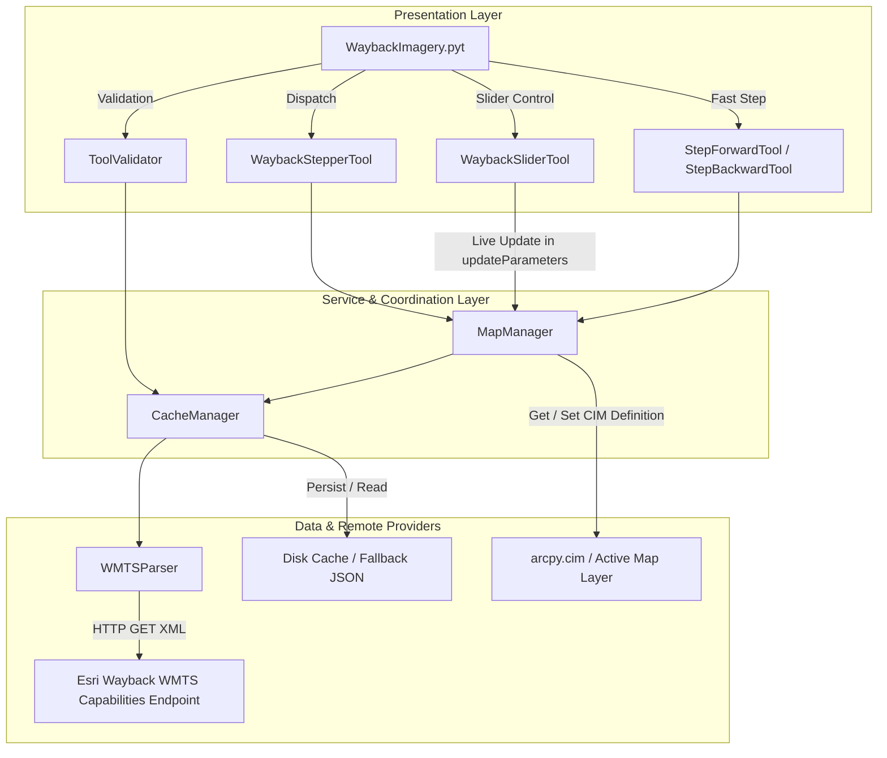

# ArcGIS Pro Wayback Imagery Add-In - Developer & Architecture Guide

## System Architecture

The add-in follows a **clean layered architecture** separating presentation (ArcGIS Pro Geoprocessing / Toolbox UI), service coordination, metadata parsing/caching, and low-level Cartographic Information Model (`arcpy.cim`) map layer manipulation.



---

## Module Directory Structure

```
TestEsriAddin/
├── FEATURES.md                       # Running capability and governance registry
├── WaybackImagery.pyt                # ArcGIS Pro Python Toolbox entry point
├── wayback_addin.log                 # Persistent runtime log file in project root
├── wayback_addin/                    # Core Python package
│   ├── __init__.py                   # Package exports and interface definition
│   ├── models.py                     # Immutable dataclasses (WaybackRelease, CapabilitiesMetadata)
│   ├── config_loader.py              # waybackconfig.json fetcher and parser
│   ├── wmts_parser.py                # WMTSCapabilities XML parser and HTTP client
│   ├── logger.py                     # Centralized rotating file logger subsystem
│   ├── cache.py                      # Multi-tier in-memory, disk, and offline caching engine
│   ├── map_manager.py                # arcpy.mp and arcpy.cim layer manipulation engine
│   ├── change_detector.py            # Local change detection and tilemap engine
│   └── data/
│       └── fallback_capabilities.json # Bundled static metadata snapshot for offline use
├── tests/                            # Comprehensive automated test suite
│   ├── __init__.py
│   ├── test_models.py                # Dataclass serialization and boundary tests
│   ├── test_config_loader.py         # waybackconfig.json loading and parsing tests
│   ├── test_logger.py                # File logging, path resolution, and rotation tests
│   ├── test_wmts_parser.py           # XML extraction and sorting unit tests
│   ├── test_cache.py                 # Cache tiering, TTL, and offline fallback tests
│   ├── test_map_manager.py           # Mock integration tests for CIM definition updates
│   ├── test_change_detector.py       # Tilemap parsing and change detection tests
│   └── test_toolbox.py               # Functional tests for .pyt validation and execution
├── documentation/
│   ├── user_guide.md                 # End-user tutorial and ribbon customization guide
│   └── developer_guide.md            # Technical architecture and API documentation
└── .junie/
    ├── plans/
    │   └── fix-metadata-querying-and-logging.md # Architectural specification and delivery plan
    └── reports/
        └── summary_<date>_<time>.md  # Final execution and delivery report
```

---

## ArcGIS Pro CIM Layer Manipulation Deep-Dive

ArcGIS Pro represents WMTS raster tile services internally using the **Cartographic Information Model (CIM)**. Rather than destroying and re-creating layers when dates change, the add-in dynamically patches the layer's CIM definition in place.

### CIM Object Structure for Wayback WMTS
```
CIMTiledServiceLayer (V3)
├── name: "World Imagery (Wayback 2026-08-05)"
├── description: "Esri World Imagery Wayback Archive\nRelease: WB_2026_R07\nDate: 2026-08-05\nMetadata Service: https://metadata.maptiles.arcgis.com/.../26334/MapServer"
└── serviceConnection: CIMWMTSServiceConnection (V3)
    ├── version: "1.0.0"
    ├── layerName: "WB_2026_R07"
    ├── style: "default"
    ├── tileMatrixSet: "default028mm"
    ├── imageFormat: "image/jpeg"
    ├── templateUrl: "https://wayback.maptiles.arcgis.com/.../tile/26334/{TileMatrix}/{TileRow}/{TileCol}"
    └── serverConnection: CIMInternetServerConnection (V3)
        ├── anonymous: True
        ├── hideUserProperty: True
        └── url: "https://wayback.maptiles.arcgis.com/arcgis/rest/services/World_Imagery/MapServer/WMTS"

**Key CIM fixes (v2024-08-24)**:
- The `serverConnection` type is `CIMInternetServerConnection` (concrete class), not `CIMInternetServerConnectionBase` (abstract base).
- The `serverConnection.url` uses the base WMTS service URL (`/WMTS`) without the capabilities XML filename.
- The `CIMWMTSServiceConnection` includes `version: "1.0.0"` for standards compliance.
- The `description` field now includes the metadata feature service URL.
```

### In-Place Dynamic Patching Routine
In `wayback_addin/map_manager.py`, the modification is executed via `getDefinition('V3')` and `setDefinition()`:
```python
cim_def = layer.getDefinition("V3")
service_conn = cim_def.serviceConnection

# Update connection parameters for the target release
service_conn.layerName = release.release_id
service_conn.templateUrl = release.tile_url_template
service_conn.style = "default"
service_conn.tileMatrixSet = "default028mm"
service_conn.imageFormat = "image/jpeg"

# Update layer titles
cim_def.name = release.title
cim_def.description = release.title

# Apply modified CIM definition back to the live layer
layer.setDefinition(cim_def)
layer.name = release.title
```
**Benefits**:
- Preserves layer blend modes, transparency, masking, and visual effects.
- Preserves layer positioning and table-of-contents grouping in the active map.
- Avoids map flickering or layout frame reference invalidation.

---

## Interactive Parameter Controls & Validation-Driven Updates

ArcGIS Pro allows overriding default parameter controls in the Geoprocessing pane using the `Parameter.controlCLSID` attribute. In `WaybackSliderTool`, this is utilized to create an interactive slider bar for scrubbable historical timeline navigation:

### Slider Configuration
```python
# Create Long integer parameter with Range filter
param_slider = arcpy.Parameter(
    displayName="Imagery Date Slider (Oldest -> Newest)",
    name="release_slider",
    datatype="GPLong",
    parameterType="Required",
    direction="Input",
)
param_slider.filter.type = "Range"
param_slider.filter.list = [1, total_releases]

# Attach the standard Esri slider control CLSID
param_slider.controlCLSID = "{C8C46E43-3D27-4485-9B38-A49F3AC588D9}"
```

### Dynamic Validation Map Updating
Rather than requiring the user to click the "Run" button to apply changes, `WaybackSliderTool` performs map updates directly inside the toolbox's `updateParameters()` callback:
- As the user moves the slider thumb in the UI, `updateParameters(parameters)` is automatically invoked by ArcGIS Pro.
- The tool looks up the corresponding `WaybackRelease` (mapping 1 to oldest, and max index to newest).
- The tool compares the target release title against the current Wayback layer name in the map's Contents pane.
- If they differ (or no Wayback layer exists yet), the tool calls `MapManager.update_or_create_layer()`, dynamically modifying the active map's CIM definition in real time.

### Re-validation Loop Prevention (Critical Design Pattern)
**Important**: In ArcGIS Pro, modifying *any* parameter value inside `updateParameters()` immediately triggers another `updateParameters()` cycle. Additionally, calling `MapManager.update_or_create_layer()` (which modifies the map's CIM definition) can cause ArcGIS Pro to re-evaluate the tool dialog, potentially resetting slider values to their defaults. Together, these behaviors create a risk of infinite re-validation loops that cause UI flickering and slider resets.

The `WaybackSliderTool` uses a **layer-name comparison guard** as the sole loop-prevention mechanism:

- **Layer name comparison**: Rather than relying on tool instance variables (which may not persist if ArcGIS Pro creates a new tool instance per validation cycle), the tool reads the actual Wayback layer name from the map's Contents pane via `MapManager.get_wayback_layer_name()`. It compares this against the target release's title. If they match, the layer already shows the selected release and no map update is needed.

This approach replaced earlier `hasBeenValidated`-based and instance-variable-based guards. The key improvements are:
1. **Durability**: The layer name persists in the map regardless of tool instance lifecycle, making deduplication reliable across validation cycles.
2. **Responsiveness**: The info text is always updated so the user sees feedback as they drag the slider, while the expensive map layer update is only performed when the release actually changes.
3. **Simplicity**: No instance state tracking is needed — the map is the single source of truth.

**Design invariant**: After `update_or_create_layer()` successfully changes the layer, the layer's name in the Contents pane is updated to the new release title. This name is what the deduplication guard reads on the next validation cycle, so the update is self-terminating.

### Save Current Layer Feature
The slider tool includes a "Save Current Layer" checkbox (`GPBoolean`, parameter index 4) that:
1. Creates an independent frozen copy of the current release via `MapManager.add_standalone_layer()`
2. The standalone layer is named "Saved: Imagery YYYY-MM-DD" — this name intentionally avoids matching `WAYBACK_LAYER_REGEX` so `find_wayback_layer()` won't treat it as the managed/adjustable layer
3. Auto-resets the checkbox to `False` after the action
4. Works independently of the slider dedup guard (saving can happen even without a slider position change)

---

## Two-Tier Hybrid Caching Engine

Interactive ribbon stepping requires sub-second execution speeds. Querying the remote WMTS endpoint on every step would introduce noticeable network latency. The `CacheManager` implements a multi-tiered fallback hierarchy:

1. **In-Memory Cache (Tier 1)**: The active session caches the parsed `CapabilitiesMetadata` in memory. Subsequent lookups execute in microseconds.
2. **Local Disk Cache (Tier 2)**: Persists metadata as JSON to `%LOCALAPPDATA%/ArcGISPro_WaybackAddin/wayback_capabilities_cache.json` with a configurable 7-day TTL (604,800 seconds).
3. **Live WMTS Endpoint (Tier 3)**: When the disk cache is expired or missing, `WMTSParser` fetches and parses the live XML, saving the result to disk and memory.
4. **Expired Disk Cache (Tier 4)**: If a network outage occurs during a refresh attempt, the expired disk cache is safely utilized as an offline fallback.
5. **Bundled Static Snapshot (Tier 5)**: If no disk cache exists and the machine is offline, `wayback_addin/data/fallback_capabilities.json` provides an immediate offline fallback with all 196+ releases.

---

## Debugging & Module Reloading in ArcGIS Pro

### Critical: Imported Module Changes Require Interpreter Restart

ArcGIS Pro has **two different reloading behaviors** for Python Toolbox code:

| What Changed | How to Reload |
|---|---|
| `.pyt` file (the toolbox itself) | **Right-click toolbox → Refresh** in the Catalog pane. Changes take effect immediately. |
| Imported modules (`wayback_addin/*.py`) | **Full Python interpreter restart required.** Refreshing the toolbox does NOT reload imported modules. |

This is a fundamental Python behavior: once a module is imported via `import`, Python caches it in `sys.modules`. Subsequent imports reuse the cached version. ArcGIS Pro's "Refresh" only re-executes the `.pyt` file — it does not clear `sys.modules`.

### Option 1: Restart ArcGIS Pro (Safest)

Close and reopen ArcGIS Pro entirely. This guarantees a clean interpreter state.

### Option 2: Force-Reload Modules in the Python Window

Paste the following into ArcGIS Pro's Python window after modifying any `wayback_addin/*.py` file:

```python
import importlib
import sys

# Remove all cached wayback_addin modules so they will be re-imported fresh
modules_to_remove = [key for key in sys.modules if key.startswith("wayback_addin")]
for mod_name in modules_to_remove:
    del sys.modules[mod_name]

print(f"Cleared {len(modules_to_remove)} cached wayback_addin modules.")
print("Now right-click the WaybackImagery toolbox → Refresh to pick up all changes.")
```

After running this, **also** right-click the toolbox and select **Refresh** so the `.pyt` file re-imports the cleared modules.

### Option 3: Reload-on-import Pattern (Development Only)

For rapid iteration during development, you can add a force-reload block at the top of the `.pyt` file (remove before production deployment):

```python
# DEV ONLY: Force-reload imported modules on every toolbox refresh
import importlib
import wayback_addin.models
import wayback_addin.cache
import wayback_addin.wmts_parser
import wayback_addin.map_manager
importlib.reload(wayback_addin.models)
importlib.reload(wayback_addin.cache)
importlib.reload(wayback_addin.wmts_parser)
importlib.reload(wayback_addin.map_manager)
```

> **Warning**: The reload order matters — modules must be reloaded in dependency order (models → cache → wmts_parser → map_manager). If module A imports from module B, reload B first.

### Common Symptoms of Stale Modules

If you modify `wayback_addin/*.py` and only refresh the toolbox, you may see:
- **Old behavior persists** despite code changes being visible in the file
- **AttributeError** for new methods or properties you just added
- **ImportError** for renamed or moved symbols
- **Stale class definitions** where `isinstance` checks fail unexpectedly

---

## Testing Strategy & Running Tests

The test suite is structured to execute seamlessly in both standalone Python 3.11+ environments and within ArcGIS Pro's Conda environment (`arcgispro-py3`).

### Running the Test Suite
Execute all automated tests from the repository root:
```powershell
& "C:\Program Files\ArcGIS\Pro\bin\Python\envs\arcgispro-py3\python.exe" -m unittest discover -s tests -v
```

### Test Coverage Summary
- **`tests/test_models.py`**: Dataclass immutability, ISO date parsing, display label formatting, and full dictionary serialization/deserialization.
- **`tests/test_wmts_parser.py`**: XML parsing, namespace handling, regex date extraction, chronological ordering (newest first), and network error handling.
- **`tests/test_cache.py`**: Hybrid cache tiering, disk TTL validation, boundary navigation (+1 newer, -1 older), and offline fallback.
- **`tests/test_map_manager.py`**: Mock integration tests for `arcpy.mp` map resolution, layer discovery, dynamic CIM updating, and `.lyrx` template creation.
- **`tests/test_toolbox.py`**: Geoprocessing parameter initialization, dynamic `updateParameters()` date dropdown population, `updateMessages()` validation, and tool execution orchestration.

---

## Developer API Quick Reference

### 1. Fetching & Accessing Releases Programmatically
```python
from wayback_addin.cache import CacheManager

cache = CacheManager()

# Get all releases (sorted newest to oldest)
releases = cache.get_releases()
print(f"Total historical releases: {len(releases)}")

# Lookup specific release
rel = cache.get_release_by_date("2026-08-05")
if rel:
    print(f"Release ID: {rel.release_id}, URL: {rel.tile_url_template}")

# Calculate adjacent release (direction: +1 = newer, -1 = older)
older_rel = cache.get_adjacent_release("WB_2026_R07", direction=-1)
```

### 2. Manipulating ArcGIS Pro Map Layers
```python
from wayback_addin.map_manager import MapManager

manager = MapManager()

# Step backward to older imagery in the active map
success, message, active_rel = manager.step_backward()
print(message)

# Jump directly to a specific historical date
success, message, active_rel = manager.set_release_by_date("2014-02-20")

# Save a standalone frozen copy of a release
rel = cache.get_release_by_date("2026-08-05")
standalone_layer = manager.add_standalone_layer(rel)
```

### 3. Metadata Service Integration & Sublayer Querying
```python
from wayback_addin.map_manager import MapManager, zoom_to_metadata_layer_id
from wayback_addin.cache import CacheManager

cache = CacheManager()
manager = MapManager(cache_manager=cache)

# Get the metadata service URL for a release
rel = cache.get_release_by_id("WB_2026_R07")
if rel and rel.metadata_service_url:
    print(f"Metadata service: {rel.metadata_service_url}")
    # Output: https://metadata.maptiles.arcgis.com/arcgis/rest/services/World_Imagery_Metadata_2026_r07/MapServer

# Map zoom level (0-23) to metadata sublayer ID (0-13)
# Formula: layerId = max(0, min(13, 23 - zoom))
layer_id = zoom_to_metadata_layer_id(zoom=19)  # Returns layer 4 (30cm resolution tier)

# Query metadata at a specific location.
# Primary approach: queries /MapServer/{layerId}/query with point intersection.
# Fallback approach: queries /MapServer/identify with map extent.
metadata = MapManager.query_metadata(rel, longitude=-122.4194, latitude=37.7749, zoom=19)
print(f"Capture date: {metadata['date']}")       # e.g. "2026-06-15" (SRC_DATE / SRC_DATE2)
print(f"Provider: {metadata['provider']}")         # e.g. "Maxar" (NICE_DESC)
print(f"Source: {metadata['source']}")             # e.g. "WV03" (SRC_DESC)
print(f"Resolution: {metadata['resolution']} m")   # e.g. 0.3
print(f"Accuracy: {metadata['accuracy']} m")       # e.g. 3.0
print(f"Sublayer: {metadata['layer_name']}")       # e.g. "30cm Resolution Metadata"
```

### 4. Persistent Full-Path File Logging
```python
from wayback_addin.logger import get_logger, setup_file_logger, get_default_log_path

# Retrieve configured file logger
logger = get_logger("wayback_addin.custom_module")
logger.info("Executing spatial query at %s", get_default_log_path())

# Logs are automatically written to wayback_addin.log in the project root directory:
# 2026-09-25 15:30:00 [INFO] wayback_addin.custom_module: Executing spatial query...
```

### 5. Map & Layer Enumeration
```python
# List all maps in the project (for tool dropdowns)
map_names = manager.list_map_names()
print(f"Available maps: {map_names}")

# List all Wayback layers in a specific map (managed + saved)
# Managed layers are returned first
wayback_layers = manager.list_wayback_layers("Map")
print(f"Wayback layers: {wayback_layers}")
# e.g. ["World Imagery (Wayback 2026-08-05)", "Saved: Imagery 2025-01-15"]
```

### 6. Key Helper Functions
```python
from wayback_addin.map_manager import derive_wmts_base_url, _build_layer_description

# Convert full capabilities URL to base WMTS service URL
base_url = derive_wmts_base_url(
    "https://wayback.maptiles.arcgis.com/.../WMTS/1.0.0/WMTSCapabilities.xml"
)
# Result: "https://wayback.maptiles.arcgis.com/.../WMTS"

# Build layer description with metadata info
desc = _build_layer_description(rel)
print(desc)
```

### 7. Local Change Detection & Capture Date Engine
```python
from wayback_addin.change_detector import (
    get_local_changes_with_metadata,
    get_releases_with_local_changes,
    lon_to_tile_x,
    lat_to_tile_y,
    scale_to_zoom_level,
)
from wayback_addin.models import LocalChangeImageryRelease

# Convert coordinates and scale to Web Mercator tile index
tile_x = lon_to_tile_x(-121.4944, zoom=15)
tile_y = lat_to_tile_y(38.5816, zoom=15)
zoom = scale_to_zoom_level(24000.0)

# Discover historical releases with local changes and resolve capture metadata
local_changes = get_local_changes_with_metadata(
    lon=-121.4944,
    lat=38.5816,
    scale=24000.0,
    max_scale=24000.0,
)

for item in local_changes:
    print(f"Capture Date: {item.capture_date} | Basemap: {item.release.release_date} | Provider: {item.provider}")
    print(f"Formatted: {item.formatted_display_name}")

# Batch-add all local change releases as separate layers in the map
from wayback_addin.map_manager import MapManager
mgr = MapManager()
added_layers = mgr.add_all_local_change_layers(local_changes, map_name="Map")
print(f"Added layers: {added_layers}")
```
